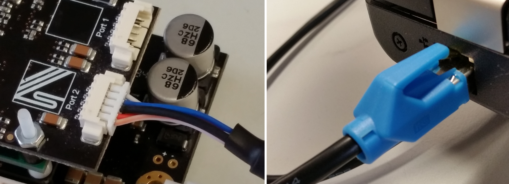

.. _SOMANET_Master_Firmware_Update_Demo_Quickstart:

SOMANET Master Firmware Update Demo Quick Start Guide
=====================================================

This is a standalone application for a Linux PC that enables SOMANET firmware deployment/update via EtherCAT communication interface. The application is not intended to be modified by a user.

Hardware setup
++++++++++++++

**Important!** Please refer to the ``SOMANET nodes firmware update via EtherCAT`` Quick Start instructions before continuing with this application. Make sure that you followed all steps there.

   Hardware Setup for SOMANET Firmware Update via EtherCAT Demo
   
To setup up the system:

   #. Connect the SOMANET Option Ethernet cable to your node (any EtherCAT port) and PC as shown in the image above.
   #. Make sure that the node is still powered and running the ``app_slave_fwupdate`` (SOMANET nodes firmware update via EtherCAT) application. 

Import and build the application
++++++++++++++++++++++++++++++++

   #. Open *xTIMEcomposer* Studio and check that it is operating in online mode. Open the edit perspective (Window->Open Perspective->XMOS Edit).
   #. Locate the ``'EtherCAT Firmware Update Demo'`` item in the *xSOFTip* plane on the bottom left of the window and drag it into the Project Explorer window in *xTIMEcomposer*.  
   #. Click on the ``app_master_fwupdate`` item in the Project Explorer pane then click on the build icon (hammer) in *xTIMEcomposer*. Check the console window to verify that the application has built successfully. 

For help in using *xTIMEcomposer*, try the *xTIMEcomposer* tutorial, which you can find by selecting Help->Tutorials from the *xTIMEcomposer* menu.

Note that the Developer Column in the *xTIMEcomposer* on the right hand side of your screen provides information on the *xSOFTip* components you are using. Select the ``module_ethercat_fwupdate`` component in the Project Explorer, and you will see its description together with API documentation. Having done this, click the `back` icon until you return to this quick start guide within the Developer Column.

Run the application
+++++++++++++++++++

Now that the application has been compiled, the next step is to run it on your Linux PC to perform the SOMANET firmware update. 

   1. Make sure that you have the binary firmware file prepared as described in the ``app_slave_fwupdate`` Quick Start instructions.
   2. If you have an IgH EtherCAT driver installed and it is running, stop it by typing the command below in terminal. Otherwise skip this step. ::
       
       sudo /etc/init.d/ethercat stop
 
   3. Navigate to the ``app_master_fwupdate`` folder using a terminal. Identify the compiled ``fw_update`` application there. 
   4. To update the firmware on the SOMANET slave device, type one of the following commands: ::

       ./fw_update eth0 -all /path/to/your/bin_file
       ./fw_update eth0 -seq 1 /path/to/your/bin_file

    The general usage of the command line is the following: ::

	 fw_update eth0 Options ID file_path

    Options: ::

       -s specify serial number for the EtherCAT slave
       -seq specify slave number in EtherCAT order 1..n
       -all update all slaves connected to the system
       -scan scan the slave/slaves connected and display their serial numbers

    Specify the ID number after options -s & -seq followed by /path/to/your/file

   5. If the firmware updated correctly you will see the flashing completed message in the terminal line. 
   6. After each flashing/firmware updating process the nodes have to be power cycled to start the new firmware.

