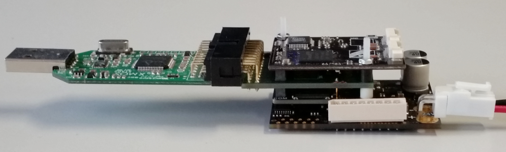

.. _SOMANET_Slave_Firmware_Update_Demo_Quickstart:

SOMANET Slave Firmware Update Demo Quick Start Guide
====================================================

This simple demonstration shows how to include firmware update functionality via EtherCAT into your application using the ``SOMANET COM-EtherCAT driver module``.

Hardware setup
++++++++++++++

A minimal requirement for this application to run is having the *SOMANET Core C22* and *SOMANET COM-EtherCAT* modules connected. In this case the stack should be separately powered via the *SOMANET Core* module with a 5V stabilized DC power source. For your convenience we recommend powering the stack via a *SOMANET IFM* board. An example of a stack consisting of the *SOMANET* COM-EtherCAT, Core-C22, and IFM-Drive-DC100 boards is shown below. In this case the *IFM-DC100* board can be supplied with 12 - 24 V DC power source.  

   Hardware Setup for SOMANET Slave Firmware Update Demo
   
To setup up the system:

   #. If you don't have the stack assembled, assemble it as shown in the image above. Make sure to connect the IFM side of the SOMANET core module to the IFM-DC100 board and COM side to the Core Debug Adapter (see markings on the Core module)
   #. Connect the xTAG-2 Adapter to the Core Debug Adapter.
   #. Connect the xTAG-2 to host PC. 
   #. Connect the *IFM-DC100* board to 12 - 24 V DC power supply
   #. Switch on the power supply. If everything is connected properly, drained current should not exceed 100mA. 

Import and build the application
++++++++++++++++++++++++++++++++

   #. Open *xTIMEcomposer* Studio and check that it is operating in online mode. Open the edit perspective (Window->Open Perspective->XMOS Edit).
   #. Locate the ``'EtherCAT Firmware Update Demo'`` item in the *xSOFTip* pane on the bottom left of the window and drag it into the Project Explorer window in *xTIMEcomposer*. This will also cause the modules on which this application depends (in this case, ``module_ethercat`` and ``module_ethercat_fwupdate``) to be imported as well. 
   #. Click on the ``app_slave_fwupdate`` item in the Project Explorer plane then click on the build icon (hammer) in *xTIMEcomposer*. Check the Console window to verify that the application has built successfully. 

For help in using *xTIMEcomposer*, try the *xTIMEcomposer* tutorial, which you can find by selecting Help->Tutorials from the *xTIMEcomposer* menu.

Note that the Developer Column in *xTIMEcomposer* Studio on the right hand side of your screen provides information on the *xSOFTip* components you are using. Select the ``module_ethercat_fwupdate`` component in the Project Explorer, and you will see its description together with API documentation. Having done this, click the `back` icon until you return to this quickstart guide within the Developer Column.

Run the application
+++++++++++++++++++

When the application has been compiled, the next step is to run it on the *SOMANET Core* module using the tools to load the application over JTAG (via the xTAG-2 and Core Debug Adapter) into the xCORE multicore microcontroller.

   #. Select the file ``main.xc`` in the ``app_slave_fwupdate`` project from the Project Explorer.
   #. Click on the ``Run`` icon (the white arrow in the green circle). 
   #. At the ``Select Device`` dialog, select ``XMOS xTAG-2 connect to L1[0..3]`` and click ``OK``.
   #. The debug console window in *xTIMEcomposer* will not display any message because the demo application is written to work with an EtherCAT master application and feedback is therefore provided via EtherCAT communication.
   #. Keep the stack powered and the application running until the next steps.

Next steps
++++++++++

The next step is to update the SOMANET firmware via EtherCAT. For this you need to prepare a binary image. Use the XFLASH application provided with *xTIMEcomposer* to prepare the image.

   #. It is assumed that the *.xe* file has been already generated. Navigate with a terminal to the folder that contains the .xe file and execute the following code (Remember that if you are using Linux, you might need to set the XMOS environment variables): ::

       xflash --factory main.xe --boot-partition-size 0x40000 -o bin_file_name.bin

   #. Your binary file will be generated and ready to be deployed into your hardware. 
   #. Navigate to the ``SOMANET nodes firmware update via EtherCAT`` (app_master_fwupdate) for the next instructions.

Examine the code
................

   #. In *xTIMEcomposer* navigate to the ``src`` directory under app_slave_fwupdate and double click on the ``main.xc`` file within it. The file will open in the central editor window.
   #. Find the main function and note that application runs 2 logical cores on the COM_TILE (tile 0).
   #. Core 1: EtherCAT Communication Handler. This core must be run on COM_TILE since this is only tile accessing the EtherCAT communication module (COM). ::

       ecat_handler(coe_out, coe_in, eoe_out, eoe_in, eoe_sig, foe_out, foe_in, pdo_out, pdo_in);

   #. Core 2: Firmware update. This core must be run on COM_TILE since it has access to the flash SPI ports. ::

       firmware_update_loop(p_spi_flash, foe_out, foe_in, sig_1);

